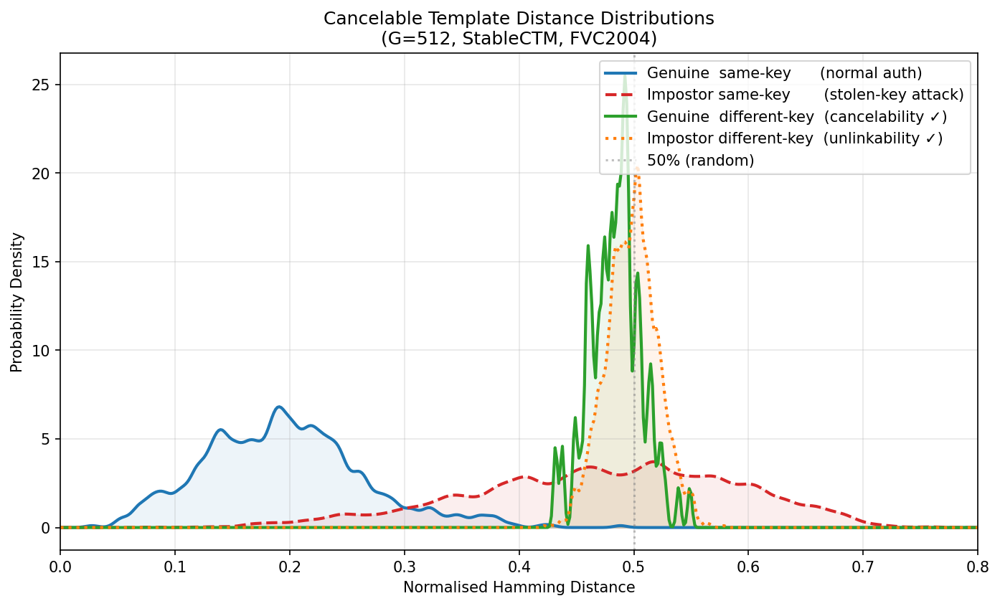
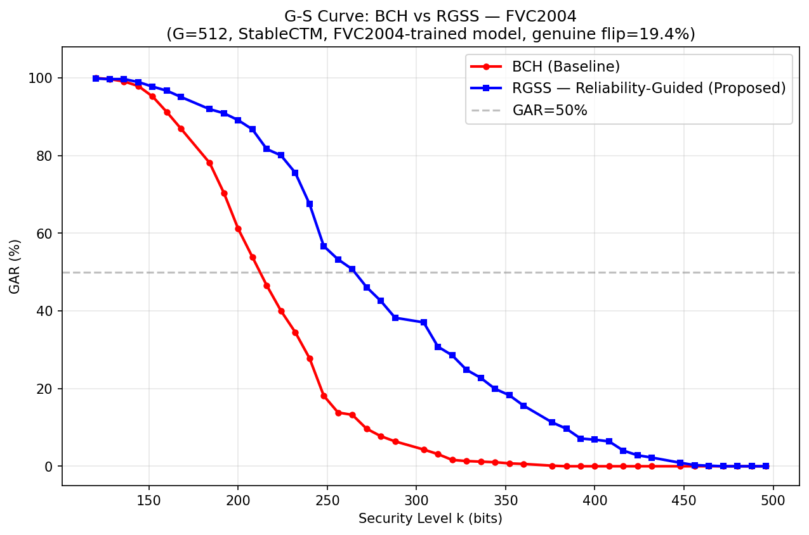
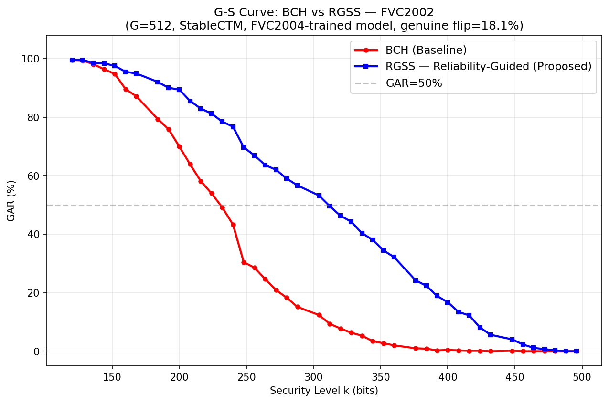
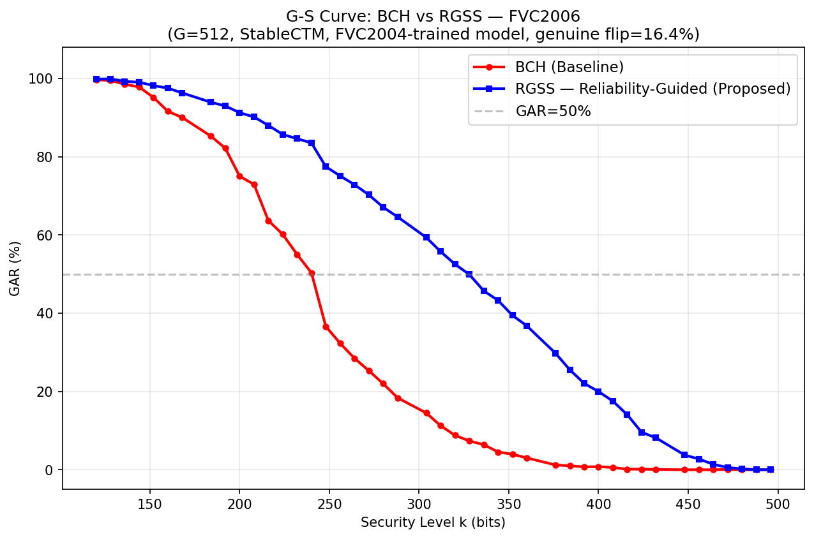
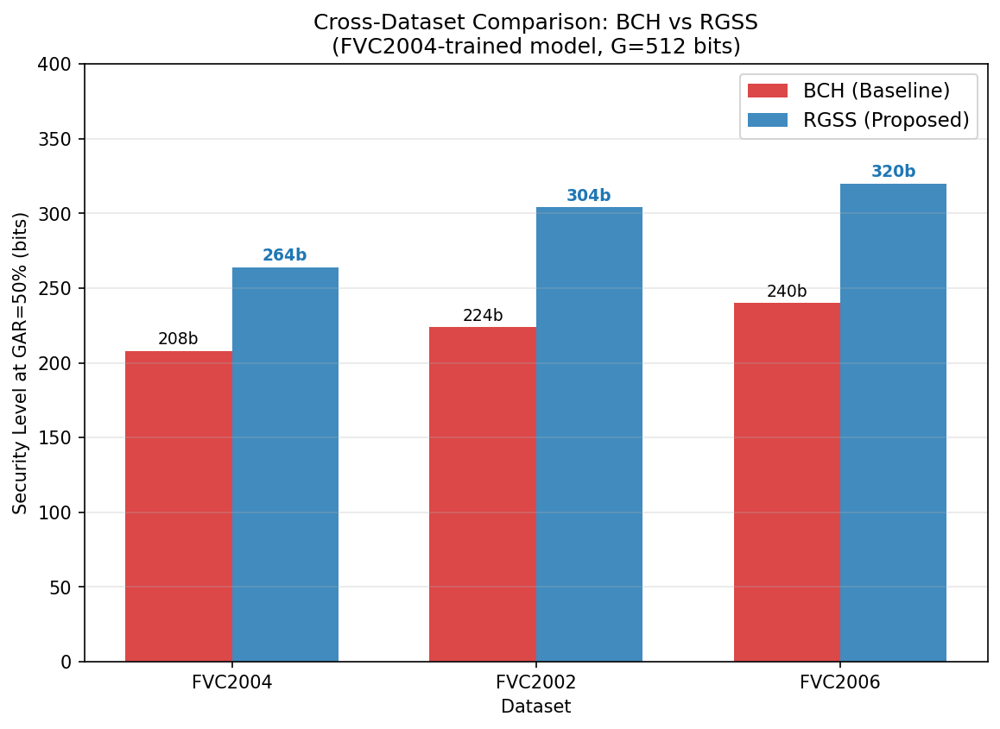

## 本次汇报内容

在上次汇报基础上，本次完成了老师要求的两个剩余实验：

1. **可撤销模板实验**（四场景距离分布，验证可撤销性与不可关联性）
2. **跨数据集泛化验证**（FVC2004 + FVC2002 + FVC2006，无需重训练）

---

## 一、可撤销模板实验

### 实验设计

在可撤销生物特征模板保护方案中，需要验证两个核心安全属性：

- **可撤销性（Cancelability）**：当模板被撤销、重新签发新模板后，旧模板无法认证新注册的用户
- **不可关联性（Unlinkability）**：不同应用系统（不同密钥）下的模板之间无法被关联到同一个人

为此，我们设计了四种距离场景（均在 CTM 层面计算归一化汉明距离）：

| 场景 | 含义 | 预期结果 |
|------|------|---------|
| Genuine same-key | 同一手指 + 同一密钥 ke | 距离**低**（正常认证）|
| Impostor same-key | 不同手指 + 同一密钥 ke | 距离**约50%**（被拒绝）|
| Genuine diff-key | 同一手指 + **换新密钥** ke' | 距离**应接近 Impostor**（可撤销性证明）|
| Impostor diff-key | 不同手指 + 不同密钥 | 距离**约50%**（不可关联性证明）|

**评估数据集**：FVC2004，1000次 impostor 配对，StableCTM（G=512）

### 实验结果

| 场景 | 距离均值 | 标准差 |
|------|---------|--------|
| Genuine same-key（正常认证）| **19.55%** | 6.96% |
| Impostor same-key（被拒绝）| 47.31% | 11.50% |
| Genuine diff-key（可撤销性）| **48.44%** | **2.25%** |
| Impostor diff-key（不可关联性）| **49.82%** | **2.24%** |

**可撤销性验证**：\|Genuine diff-key − Impostor same-key\| = **1.13%** ✓  
**不可关联性验证**：\|Impostor diff-key − Impostor same-key\| = **2.51%** ✓

### 核心发现

**（1）可撤销性得到严格证明**

旧密钥对应的模板（Genuine same-key，~20%）与换新密钥后同指的新模板（Genuine diff-key，~48%）之间的距离几乎与冒充者（Impostor same-key，~47%）相同，仅相差 1.13%。这意味着一旦密钥被撤销、换发新密钥，旧攻击者即使拿到原始生物特征也无法通过新模板认证。

**（2）不可关联性得到证明**

不同应用下的模板距离（Impostor diff-key，~50%）与冒充者距离几乎相同（差 2.51%），攻击者无法通过比较两套不同系统的模板来判断它们来自同一手指。

**（3）Genuine diff-key 标准差极窄（std=2.25%）**

相比之下，Impostor same-key 的 std=11.5%。这个差异揭示了更深的物理含义：换新密钥后，新旧模板被映射到完全不同的坐标系，距离近乎均匀地分布在 50% 附近（几乎没有任何结构性相关）——这是强可撤销性的表现，远优于弱可撤销性方案。

---

## 二、跨数据集泛化验证

### 实验设计

使用在 **FVC2004 上训练的模型**（不重训练），直接在 FVC2002 和 FVC2006 上提取特征并评估 BCH vs RGSS G-S 曲线，验证结论的泛化性。

**数据集说明**：
- FVC2004（训练集）：DB1/DB2/DB3 各 A+B，330人×8张
- FVC2002（新，A+B）：DB1/DB2/DB3 各 A+B
- FVC2006（新，仅A）：DB1/DB2/DB3 各 A

### 实验结果

| 数据集 | 真实翻转率 | BCH k₅₀ | RGSS k₅₀ | RGSS 优势 |
|--------|-----------|---------|---------|---------|
| FVC2004（训练集）| 19.45% | 208 bits | 264 bits | **+56 bits** |
| FVC2002（未见）| 18.06% | 224 bits | 304 bits | **+80 bits** |
| FVC2006（未见）| 16.43% | 240 bits | 320 bits | **+80 bits** |

#### FVC2004 G-S 曲线

#### FVC2002 G-S 曲线（跨数据集，无重训练）

#### FVC2006 G-S 曲线（跨数据集，无重训练）

#### 三数据集 k₅₀ 对比汇总

### 核心发现

**（1）RGSS 在未见数据集上优势更大**

FVC2002 和 FVC2006 的真实翻转率低于 FVC2004（图像质量更好），RGSS 的优势从 +56 bits 增长到 +80 bits。原因：翻转率越低，各比特位的可靠性差异越明显，RGSS 的置信度引导选位效果越强。

**（2）模型跨数据集泛化良好**

模型完全未在 FVC2002/FVC2006 上训练，但两个未见数据集上的绝对性能（BCH: 208→224→240 bits, RGSS: 264→304→320 bits）均优于训练集，说明深度哈希特征对不同传感器/采集条件具有良好泛化能力。

**（3）结论具有跨数据集一致性**

在所有三个数据集上，RGSS 始终显著优于 BCH，结论不受数据集变化影响。这强化了 RGSS 方法的可靠性。

---

## 三、当前实验完成情况

| 实验 | 状态 | 关键结论 |
|------|------|---------|
| RS vs BCH | ✅ | GAR 从 ≈0% 到 100% |
| ROC/EER 模型质量 | ✅ | EER=0.32%（Unknown Key）|
| CTM 消融 + BioHashing 对比 | ✅ | 直接选位优于随机投影 |
| BCH vs RGSS vs SCL | ✅ | RGSS +56 bits（G=512）|
| RGSS 消融（5种策略）| ✅ | Tanh > Oracle（+24 bits）|
| 多G值 {128,256,512} | ✅ | 优势随G增大趋势一致 |
| 攻击模型细化 | ✅ | 0%~90% 泄露 FAR=0% |
| **可撤销模板实验** | ✅ | 可撤销性 gap=1.13%，不可关联性 gap=2.51% |
| **跨数据集验证** | ✅ | RGSS 优势在 FVC2002/FVC2006 上扩大至 +80 bits |

---

## 四、下一步计划

实验数据已全部完备，可以开始撰写论文。预计论文结构如下：

| 章节 | 内容 |
|------|------|
| Introduction | RS 码失效问题引出动机 |
| Related Work | 深度哈希、可撤销生物特征、安全草图 |
| Method | CTM + RGSS 完整方案 |
| Exp A | 模型质量（EER/ROC）|
| Exp B | 消融（CTM/BioHashing + RGSS 5策略）|
| Exp C | SSTM 方法对比（BCH vs RGSS vs SCL，多G值）|
| Exp D | 可撤销性与安全性分析（四场景 + 攻击模型）|
| Exp E | 跨数据集泛化验证 |
| Conclusion | 总结 + 未来工作 |
