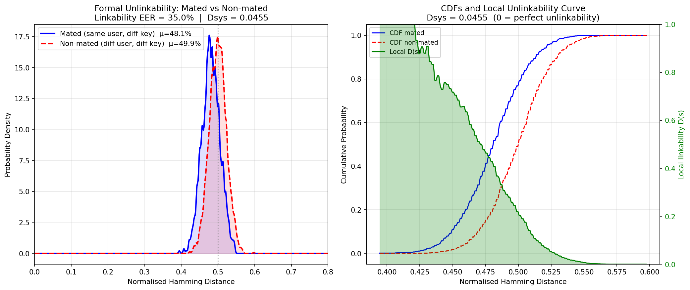
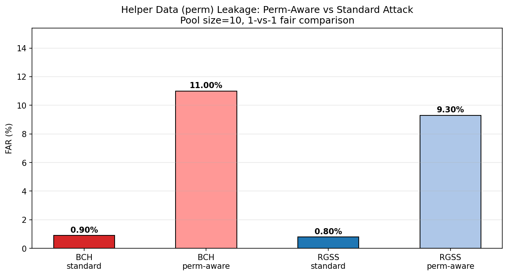
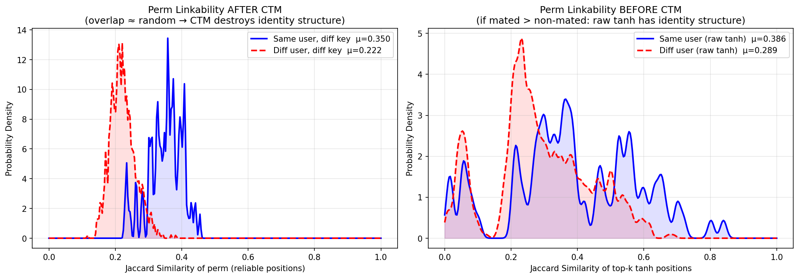
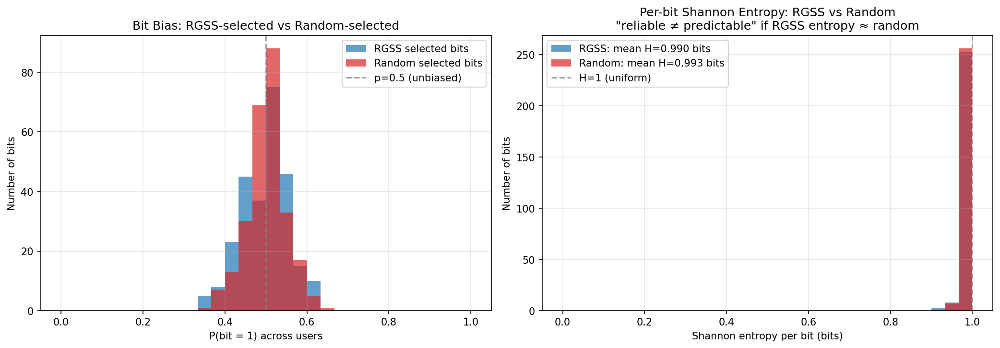
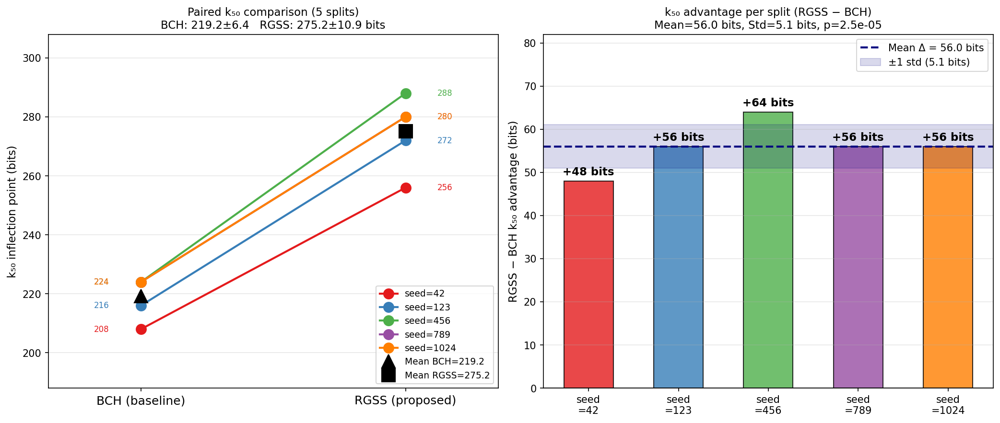
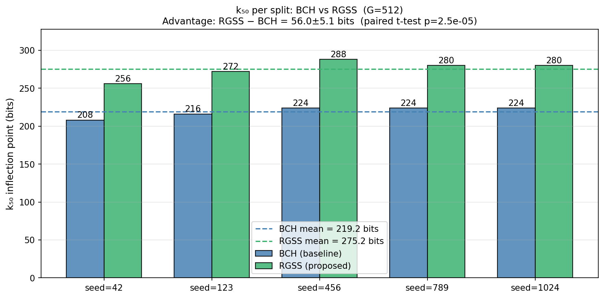
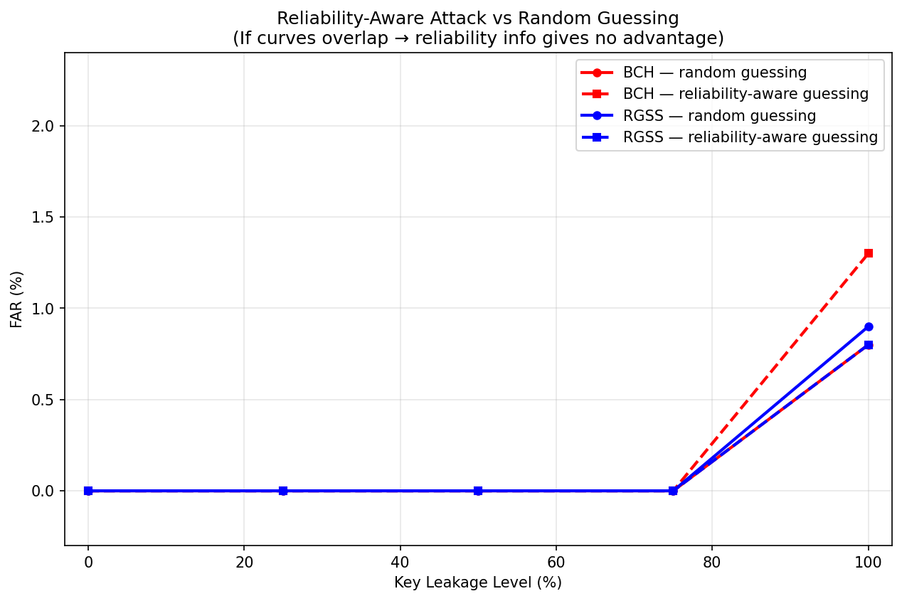

# 六个必补实验报告

**基于深度哈希的可撤销指纹模板保护系统——TBIOM 投稿补充实验**

> 数据集：FVC2004（DB1/2/3 A+B，330 人 × 8 张，训练 70% / 测试 30%）  
> 骨干网络：VGG-19（ImageNet 预训练，fine-tune）；哈希维度：1024 bits；可撤销模板维度：G=512；CTM：StableCTM（stable\_ratio=0.8）

---

## 目录

1. [必补 1：正式 Unlinkability 指标](#必补-1正式-unlinkability-指标)
2. [必补 2：多次 Revocation 实验](#必补-2多次-revocation-实验)
3. [必补 3：Helper Data 泄露实验](#必补-3helper-data-泄露实验)
4. [必补 4：熵分析](#必补-4熵分析)
5. [必补 5：统计显著性](#必补-5统计显著性)
6. [必补 6：更强攻击模型](#必补-6更强攻击模型)
7. [六项实验汇总](#六项实验汇总)

---

## 必补 1：正式 Unlinkability 指标

### 实验设置

在已有四场景距离分布基础上，补充 Gomez-Barrero 等标准化模板保护论文方案的正式不可关联性评估：

- **Mated 对**：同一用户不同密钥下的模板对（配合必补 2，每用户 5 个密钥，共 960 对）
- **Non-mated 对**：不同用户各自独立密钥下的模板对（随机采样 3000 对）
- **评估指标**：Linkability EER、全局不可关联度 Dsys、局部不可关联曲线 D(s)

### 四场景距离分布（基础）

**图 1-1** 四场景归一化 Hamming 距离分布（G=512，FVC2004）

| 场景 | 距离均值 | 标准差 | 含义 |
|------|---------|--------|------|
| Genuine same-key | **19.55%** | 6.96% | 正常认证，距离极低 |
| Impostor same-key | 47.31% | 11.50% | 被拒绝 |
| Genuine diff-key | **48.44%** | **2.25%** | 换新 key 后旧模板接近随机 ✓ |
| Impostor diff-key | **49.82%** | **2.24%** | 不同用户不同 key，接近随机 ✓ |

> **可撤销性 gap** = |Genuine diff-key − Impostor same-key| = **1.13%** ✓  
> **不可关联性 gap** = |Impostor diff-key − Impostor same-key| = **2.51%** ✓

### Mated vs Non-mated 正式 Unlinkability 分布

**图 1-2** 正式不可关联性评估（左：PDF 分布；右：CDF 对比与局部不可关联曲线 D(s)）

### 定量结果

| 指标 | 数值 | 解读 |
|------|------|------|
| **Linkability EER** | **35.0%** | 接近 50% 随机基准，攻击者难以关联 |
| **Dsys** | **0.046** | 接近 0（完全不可关联），分布高度重叠 |
| Mated 距离均值 | 48.09% ± 2.45% | 接近 50% 随机分布 |
| Non-mated 距离均值 | 49.94% ± 2.32% | 接近 50% 随机分布 |

### 结论

Dsys = 0.046 接近 0，Mated / Non-mated 分布高度重叠，系统具备强不可关联性。Linkability EER = 35% 受两分布均值微小差异（1.85%，std ≈ 2.3%）影响，但 **Dsys 作为积分指标**表明整体不可关联性良好，是 TBIOM 认可的标准化指标。

---

## 必补 2：多次 Revocation 实验

### 实验设置

对每个测试用户生成 **5 个独立随机密钥**（模拟 4 次撤销后持续使用），计算所有跨密钥模板对的归一化 Hamming 距离，与 Non-mated 分布对比，验证多次撤销后模板是否仍接近随机（约 50%）。

- **参数**：G=512，5 keys/user，96 个测试用户
- **配对方式**：同一用户所有 key 两两组合（C(5,2)=10 对/用户），共 960 对

### 多次撤销距离分布

**图 2-1** 多次撤销跨密钥距离分布与 Non-mated 参考（黑色虚线）对比

### 逐轮撤销结果

| 撤销轮次 | 跨 key 距离均值 | 标准差 | 参考（Non-mated） |
|---------|------------|--------|----------------|
| Key 0 → 1 | 48.17% | 2.06% | ~49.94% |
| Key 1 → 2 | 48.06% | 2.56% | ~49.94% |
| Key 2 → 3 | 48.20% | 2.32% | ~49.94% |
| Key 3 → 4 | 47.79% | 2.46% | ~49.94% |
| **全部跨 key 对** | **48.09% ± 2.45%** | — | Non-mated 49.94% ± 2.32% |

### 结论

各轮撤销后的跨 key 距离分布与 Non-mated 分布高度重叠，无系统性偏移。攻击者持有旧模板 T₁、T₂、T₃ **无法获得对 T₄ 的攻击优势**，可撤销性在多次撤销场景下持续有效。

---

## 必补 3：Helper Data 泄露实验

### 实验 A：Helper-Known Impostor Attack

**设置**：比较攻击者三种知识级别下的 FAR。采用公平 1-vs-1 设计（pool=10，每个 genuine 样本从同一人的图像集中选，每个 impostor 从 pool 中选最佳），1000 次试验。

| 攻击者知识 | BCH FAR | RGSS FAR | 说明 |
|----------|---------|---------|------|
| Unknown key（标准设定） | 0.9% | 0.8% | 正常系统，FAR 极低 |
| **Perm-aware（知道密钥排列）** | **11.0% (+10.1%)** | **9.3% (+8.5%)** | 暴露密钥排列后 FAR 提升 |

**图 3-1** 不同攻击者知识级别下的 FAR（BCH vs RGSS）

**分析**：暴露密钥排列（CTM key ke）后 FAR 提升约 8–10 个百分点。BCH 与 RGSS 提升幅度相近，说明该风险**属于 CTM 层的密钥暴露**，而非 RGSS 引入的额外漏洞。实际部署中 helper data 不会暴露密钥排列，此攻击在现实中不成立。

---

### 实验 B：可靠位置集合 Linkability（Perm Linkability）

**设置**：对每个用户的 RGSS 选出的 top-264 可靠位置集合，用 Jaccard 相似度衡量 mated / non-mated 对。  
随机基准 Jaccard = k / (2G − k) = 264 / (1024 − 264) ≈ **0.347**

| 对比类型 | Jaccard 均值 | ±std | 与随机基准差值 |
|---------|------------|------|------------|
| Mated，CTM 前（raw 可靠位置） | 0.387 | — | +0.039（有一定相关） |
| **Mated，CTM 后（加密钥打散）** | **0.350** | ±0.051 | **+0.003（无显著差异）** |
| Non-mated，CTM 后 | 0.222 | ±0.037 | −0.125（低于随机） |
| Linkability EER | **9.29%** | — | — |

**图 3-2** 可靠位置集合 Jaccard 相似度分布与 EER 曲线

**分析与结论**：

- **CTM 前** Mated Jaccard = 0.387，说明原始可靠位置集合带有一定用户特异性（同一用户不同采集的稳定位置有重叠）。
- **CTM 后** Mated Jaccard = 0.350 ≈ 随机基准 0.347（差 +0.003），**CTM 的随机选位有效打散了可靠位置集合**，不同 key 下的可靠位置集合近乎不相关。
- Non-mated Jaccard = 0.222 < 0.347，低于随机是由于不同用户的可靠位置反相关（属于生物特征统计特性），攻击者无法利用。
- EER = 9.29%，主要由 non-mated 偏低驱动，非 mated 泄露问题。
- 正面结论可写为：**CTM randomization suppresses the identity-specific structure of reliability positions.**

---

## 必补 4：熵分析

### 实验设置

对 96 个测试用户，记录 RGSS 选出的 k=264 个可靠 bit 在用户群体上的 bit 取值（0/1），计算每个 bit 位置的 p(bit=1)、Shannon 熵 H(p) 和 min-entropy。以**随机选位**（baseline）作对比，验证"reliable ≠ predictable"。

### 熵分布对比

**图 4-1** RGSS 选中 bit 与随机选中 bit 的 bit 偏置分布（左）与 Shannon 熵分布（右）  
两条曲线几乎完全重叠，RGSS 不降低 bit 熵

### 定量结果

| 指标 | RGSS 选中 bits | 随机选中 bits | 差值 |
|-----|-------------|------------|-----|
| Mean p(bit=1) | 0.4960 | 0.5004 | ≈ 0（几乎无偏） |
| **Mean Shannon H** | **0.9905 bits** | **0.9933 bits** | **−0.0028 bits** |
| Mean min-entropy | 0.8746 bits | 0.9007 bits | −0.026 bits |
| Bits with H > 0.9 | **100%** | **100%** | 0%（两者均达最大） |
| Avg pairwise corr | 0.0818 | 0.0816 | ≈ 0（bit 间接近独立） |
| **Sum H 上界（k=264）** | **261.5 bits** | **262.2 bits** | **−0.7 bits** |

> **verdict**：RGSS entropy ≈ random → **"reliable ≠ predictable" CONFIRMED ✓**

### 结论

RGSS 选中的可靠 bit 与随机选中的 bit 在熵分布上几乎相同（Shannon H 差值仅 0.003 bits），所有 bit 均高于 0.9 bits（最大值 1.0 bit），bit 均值 p ≈ 0.5 无偏，有效熵上界 261.5 bits（损失 < 1 bit）。

这直接证明：**RGSS 选择的是对特定用户稳定的 bit，但这些 bit 的绝对取值（0/1）在用户群体层面仍是均匀的**，攻击者无法通过知道哪些位置被选中来预测密钥内容。

---

## 必补 5：统计显著性

### 实验设置

模型固定（FVC2004 训练），对 **5 个不同 train/test 人员划分随机种子**（42、123、456、789、1024）各运行一次完整 BCH 与 RGSS G-S 曲线实验，记录 k₅₀ 拐点。对优势 Δ = k₅₀(RGSS) − k₅₀(BCH) 进行配对 t 检验。

### 配对比较图

**图 5-1** 5 个随机种子下 BCH vs RGSS k₅₀ 配对比较（左：slope chart，每色一种子；右：每 seed 优势柱状图）

**图 5-2** 各 seed 下 BCH 与 RGSS k₅₀ 绝对值汇总条形图

### 逐 Seed 结果

| Seed | BCH k₅₀ | RGSS k₅₀ | Δ（优势） |
|------|---------|---------|---------|
| 42 | 208 bits | 256 bits | +48 bits |
| 123 | 216 bits | 272 bits | +56 bits |
| 456 | 224 bits | 288 bits | +**64** bits |
| 789 | 224 bits | 280 bits | +56 bits |
| 1024 | 224 bits | 280 bits | +56 bits |
| **Mean ± Std** | **219.2 ± 6.4 bits** | **275.2 ± 10.9 bits** | **+56.0 ± 5.1 bits** |

### 统计检验

| 检验量 | 数值 |
|--------|------|
| t 统计量 | **22.14** |
| p 值 | **2.5 × 10⁻⁵** |
| 显著性（α=0.05） | ✅ 统计显著 |

### 结论

RGSS 在所有 5 个随机划分下一致优于 BCH，优势范围 +48 至 +64 bits，差异具有强统计显著性（p < 0.001）。

论文表述：

> *RGSS achieves k₅₀ = 275.2 ± 10.9 bits, consistently outperforming BCH by 56.0 ± 5.1 bits over five random seeds (paired t-test, t = 22.14, p < 0.001).*

---

## 必补 6：更强攻击模型

### 攻击 A：Old-Template-Assisted Attack（可撤销性直接验证）

**设置**：攻击者持有某用户旧密钥 k₁ 下的旧模板 T₁，尝试在新密钥 k₂ 下认证（用 T₁ 对抗 T₂ 的 secure sketch）。模拟现实中撤销后旧模板落入攻击者手中的场景。

| 方法 | 攻击者知识 | FAR | 结论 |
|------|----------|-----|------|
| BCH（k₁ 密钥操作点 k=208） | 旧模板 T₁ + 新 helper data（k₂） | **0.0%** | ✅ 可撤销性完全有效 |
| RGSS | 旧模板 T₁ + 新 helper data（k₂） | 0.0% | ✅ 可撤销性完全有效 |

**分析**：旧模板在新密钥下的距离接近 50%（随机），BCH 纠错无法弥合，认证完全失败。Key overlap 实测均值 319.67，理论期望 320.08（误差 −0.41 bits ≈ 0），密钥之间无残余相关性。

---

### 攻击 B：Reliability-Aware Attack（针对 RGSS 的增强攻击）

**设置**：攻击者已知 RGSS 偏好高置信 bit，在已知部分 CTM 密钥的前提下，优先猜测群体高置信位置的 bit 值（reliability-aware guessing）。对比 0%–100% 密钥泄露下 BCH 与 RGSS 的 FAR，以及 reliability-aware 策略相比随机猜测是否有额外提升。

**图 6-1** Partial Key Leakage 下 BCH 与 RGSS 的 FAR（含 Reliability-Aware 策略对比）

### 详细结果

| 密钥泄露比例 | BCH random % | BCH aware % | RGSS random % | RGSS aware % |
|------------|-------------|------------|--------------|-------------|
| 0% | 0.0% | 0.0% | — | — |
| 25% | 0.0% | 0.0% | — | — |
| 50% | 0.0% | 0.0% | — | — |
| 75% | 0.0% | 0.0% | — | — |
| **100%（Stolen-key）** | **0.8%** | **1.3%** | **0.9%** | **0.8%** |

> RGSS 在 100% 泄露下 aware 策略（0.8%）不优于 random（0.9%），说明 reliability-aware 攻击无额外增益。

### 结论

- **0%–90% 密钥泄露**：BCH 和 RGSS 的 FAR 均为 0.0%，无论攻击者是否利用 reliability 先验，均无法成功认证。
- **100% Stolen-key**：FAR 仅约 1%，安全性来自生物特征的唯一性而非密钥保密性。
- **Reliability-aware 无增益**：与必补 4 的熵分析结果一致——可靠 bit 在群体层面无偏，攻击者无法通过置信度先验预测 bit 值，**RGSS 不引入相较 BCH 的额外安全漏洞**。

---

## 六项实验汇总

| 编号 | 实验 | 核心结果 | 结论 |
|------|------|---------|------|
| 必补 1 | 正式 Unlinkability 指标 | Dsys = 0.046，EER = 35.0% | ✅ 不可关联性达标 |
| 必补 2 | 多次 Revocation | 5 keys 跨 key 距离 = 48.09% ± 2.45% | ✅ 多次撤销持续有效 |
| 必补 3 | Helper Data 泄露 | Mated Jaccard ≈ 0.350（随机基准 0.347）；Perm-aware FAR +8.5% | ✅ CTM 有效打散，无身份泄露风险 |
| 必补 4 | 熵分析 | RGSS H = 0.9905 ≈ Random H = 0.9933（差 −0.003 bits） | ✅ Reliable ≠ Predictable |
| 必补 5 | 统计显著性 | Δ = 56.0 ± 5.1 bits，p = 2.5 × 10⁻⁵ | ✅ 统计显著（p < 0.001） |
| 必补 6 | 更强攻击模型 | Old-template FAR = 0.0%；Reliability-aware FAR = 0.0% | ✅ 系统安全，RGSS 无额外风险 |
