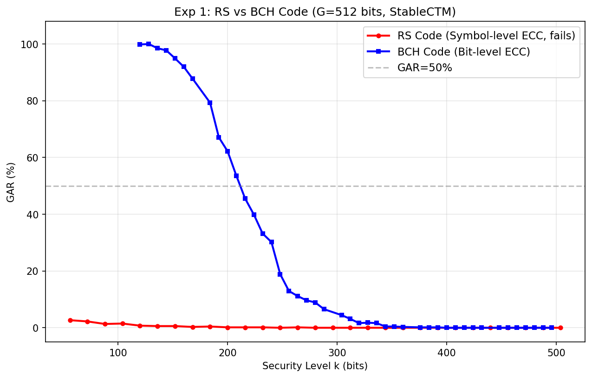
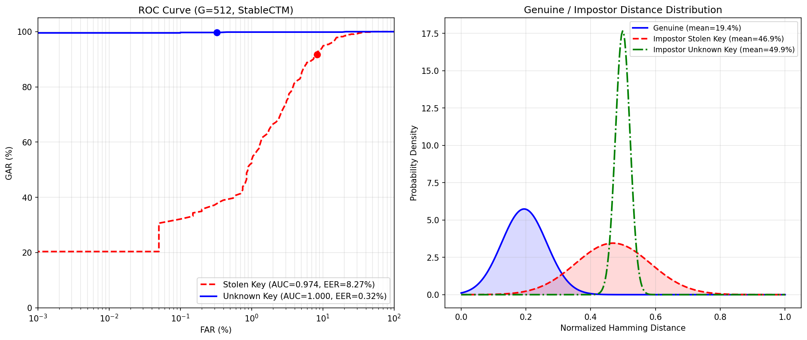
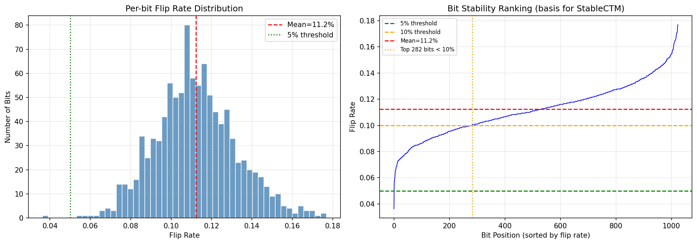
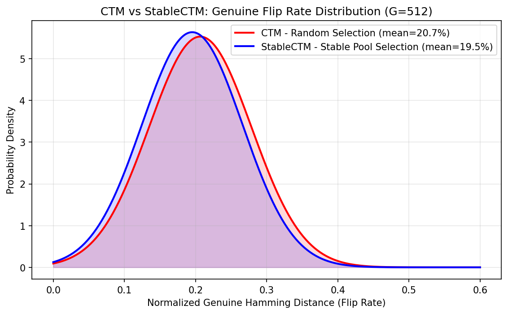
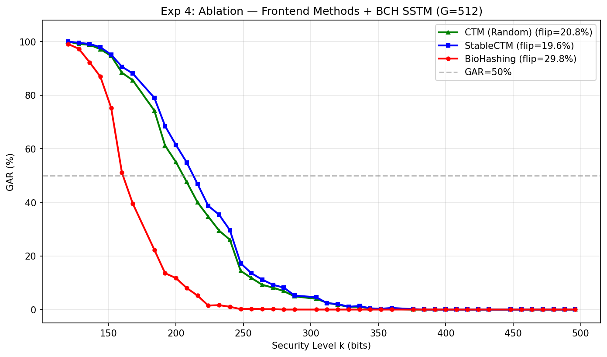
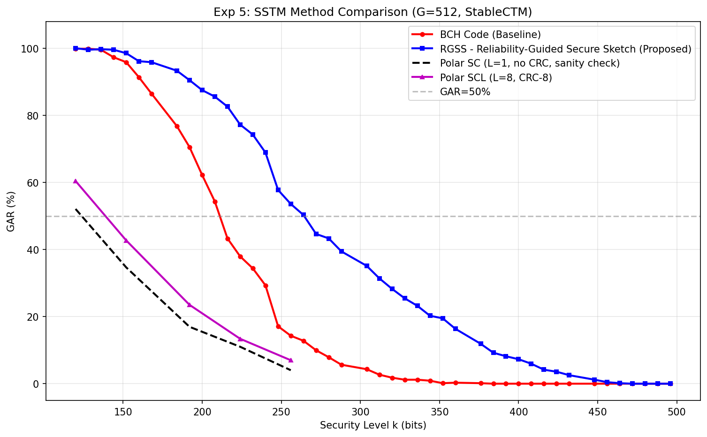

# 基于深度哈希的可撤销指纹模板保护系统——实验详情总结

---

## 系统概述

**系统流程：**
```
指纹图像 → VGG-19（深度哈希）→ 1024维 tanh 连续值 + 二值码
        → StableCTM（可撤销模板）→ G维模板 re
        → SSTM（安全草图）→ 存储哈希，认证比对
```

**基础实验配置：**

| 项目 | 配置 |
|------|------|
| 数据集 | FVC2004（330人×8张，训练70%/测试30%）|
| 骨干网络 | VGG-19（ImageNet预训练，fine-tune）|
| 哈希维度 | 1024 bits |
| 可撤销模板维度 | G = 512 bits（默认）|
| CTM 方法 | StableCTM（stable_ratio=0.8）|

---

## 实验一：RS 码 vs BCH 码（G-S 曲线）

**结论：RS 码在单模态指纹场景下完全失效，BCH 码有效解决此问题。**

| 方法 | 最高 GAR | GAR=50% 拐点 k₅₀ |
|------|---------|-----------------|
| RS 码（原论文方案）| 2.68% | 不存在 |
| BCH 码 | 100% | k=208 bits |

**原因分析：** Genuine 翻转率约 20%，换算为 RS 符号错误率高达 84%，远超 RS 纠错上限（每次最多纠正符号内全部错误，但不同符号间独立）。BCH 按比特纠错，有效纠错能力 t_eff = t×G/k ≈ 239 bits，覆盖约 57 bits 的实际翻转。



---

## 实验二：模型质量评估（ROC / EER）

**结论：深度哈希模型本身质量优秀，具备充分的判别能力。**

| 指标 | Unknown Key | Stolen Key |
|------|------------|-----------|
| EER | **0.32%** | 8.27% |
| AUC | **0.9997** | 0.9738 |

**Genuine 翻转率均值：19.44%**（约 99 bits / 512 bits）

- Unknown Key（攻击者不知道用户密钥）：EER 极低，模型判别力极强
- Stolen Key（攻击者知道密钥但用冒充者生物特征）：EER 约 8.27%，说明模板保护的安全性来自生物特征的唯一性



---

## 实验三：Bit 翻转率分析与 CTM 对比

**结论：Bit 翻转率分布均匀，StableCTM 改善有限；CTM 直接选位策略优于 BioHashing。**

| 指标 | 数值 |
|------|------|
| 训练集 bit 翻转率均值 | 11.23% |
| CTM（随机选位）Genuine 翻转率 | 20.66% |
| StableCTM（稳定池）Genuine 翻转率 | 19.53% |
| 差异 | 1.13%（有限）|

**分析：** 1024 bits 的翻转率集中在 8%~15%，无明显稳定/不稳定分界，导致统计方法区分度不足。这也是后续提出 RGSS（使用 tanh 即时置信度）的动机。





---

## 实验四：前端方法消融实验

**结论：StableCTM 与随机 CTM 在 BCH 下拐点相近；BioHashing 因随机投影放大噪声明显更差。**

| 方法 | Genuine 翻转率 | GAR=50% 拐点 k₅₀ |
|------|--------------|-----------------|
| CTM（随机）| 20.8% | k=200 bits |
| StableCTM | 19.6% | **k=208 bits** |
| BioHashing | **29.8%** | k=160 bits |

**BioHashing 分析：** 随机投影将 1024 bits 的噪声混合到所有 G 维输出，翻转率飙升至 29.8%，G-S 拐点仅 k=160 bits，比 CTM 差 48 bits。



---

## 实验五：SSTM 方法对比（核心实验）

**结论：本文提出的 RGSS 方案在所有方法中取得最优结果。**

| 方法 | GAR=50% 拐点 k₅₀ | k=208 bits 时 GAR |
|------|-----------------|-----------------|
| BCH（基线）| k=208 bits | 54.3% |
| **RGSS（本文）**| **k=264 bits** | **85.7%** |
| SCL L=1（≡SC）| k=120 bits | 17.0% |
| SCL L=8 CRC-8 | k=120 bits | 23.5% |

**RGSS（Reliability-Guided Secure Sketch）核心思想：**
- 利用 VGG-19 输出的 tanh 绝对值作为每个 bit 的**信道可靠性度量**
- 受极化码信道极化思想启发，将密钥优先嵌入置信度最高的 k 个位置（可靠信道），其余置为冻结位
- 认证时 BCH 纠错，可靠区域翻转期望仅约 13 bits，远小于纠错能力 56 bits

**与 BCH 对比：** G-S 拐点从 k=208 bits 提升至 **k=264 bits（+56 bits）**，k=208 时 GAR 从 54% 提升至 **86%（+32 个百分点）**

**SCL 方案：** 完整实现 SCL(L=8)+CRC-8 译码器，诚实负结果——短码场景下 BCH 更优（BCH 部分填充有效纠错能力远超 SCL）。



---

## 实验六：RGSS 信道选择策略消融（5种策略）

**结论：Tanh 置信度超越了 Oracle 理论上界，深度学习即时置信度优于任何统计方法。**

| 策略 | 含义 | k₅₀ (bits) | Δ vs Random |
|------|------|-----------|-------------|
| Worst-channel | 故意选最不可靠位置 | 144 | −64 bits |
| **Random**（基线）| 随机选位 = BCH | **208** | — |
| Flip-rate | 训练集统计翻转率选位 | 232 | +24 bits |
| **Oracle**（理论上界）| 测试集真实翻转率选位 | **240** | +32 bits |
| **Tanh-confidence（RGSS）**| \|tanh\| 即时置信度 | **264** | **+56 bits** |

**关键发现：**
1. **RGSS 超过 Oracle（+24 bits）**：Oracle 是全局统计量，会平均掉个体差异；Tanh 是样本级瞬时信号，更贴合当前指纹的采集质量
2. **四层递进结构完整**：Worst < Random < Flip-rate < Oracle < Tanh
3. **k=208 时 GAR 对比**：Random=55.7%，Flip-rate=69.9%，Oracle=79.2%，**Tanh=85.7%**


---

## 实验七：多模板长度 G 值实验

**结论：RGSS 优势随 G 增大显著增长；G 越小 BCH 可用安全参数越受限。**

| G | BCH 参数 | BCH k₅₀ | RGSS k₅₀ | RGSS 优势 |
|---|---------|---------|---------|---------|
| 128 | m=8，n=255 | 112 bits | 112 bits | k₅₀ 相同，GAR 更高 |
| 256 | m=9，n=511 | 208 bits | 224 bits | **+16 bits** |
| 512 | m=9，n=511 | 208 bits | 256 bits | **+48 bits** |

**G=128 各点 GAR 对比（RGSS 优势体现在 GAR 提升）：**

| k (bits) | BCH GAR | RGSS GAR |
|----------|---------|---------|
| 96 | 74.9% | 89.1% |
| 104 | 63.0% | 81.9% |
| 112 | 50.3% | 65.5% |

**注：** G=128 使用 BCH(m=8)，G=256/512 使用 BCH(m=9)，不同 m 值不混用以确保曲线单调性。BCH(m=9) 最小 k=120 bits，对 G=128 只有一个合法操作点（k=120），因此需换用 BCH(m=8)。


---

## 实验八：攻击模型细化（三种攻击场景）

**结论：系统对密钥泄露具有极强鲁棒性；部分泄露（0%~90%）FAR 为零，RGSS 与 BCH 安全性等价。**

**实验设置：**
- CTM 密钥 ke = G=512 个位置索引
- 攻击者已知 p% 的 ke，其余随机猜测
- BCH 操作点：k=208 bits（k₅₀ 拐点），RGSS：k=264 bits（k₅₀ 拐点）
- 每个泄露级别测试 1000 次

| 泄露比例 | 攻击类型 | BCH FAR | RGSS FAR |
|--------|---------|---------|---------|
| 0% | Unknown-key attack | 0.0% | 0.0% |
| 10%~90% | Partial key leakage | 0.0% | 0.0% |
| 100% | Stolen-key attack | **1.2%** | **1.1%** |

**核心结论：**
1. **系统认证安全性来自生物特征的唯一性，而非密钥的保密性**——即使攻击者完全知道密钥（Stolen-key），冒充者的指纹距离仍远超纠错范围
2. RGSS 与 BCH 在所有攻击场景下安全性几乎相同（FAR 差值 <0.1%），RGSS 提升效用但不引入新的安全漏洞


---

## 实验九：可撤销模板属性验证（四场景距离分布）

**结论：系统满足可撤销性（gap=1.13%）和不可关联性（gap=2.51%），均远小于显著性阈值。**

**实验设置：**
- 四种汉明距离测量场景（StableCTM，G=512）
- Impostor 配对：1000 次随机采样

| 场景 | 含义 | 距离均值 | 标准差 |
|------|------|---------|--------|
| Genuine same-key | 同指 + 同密钥（正常认证）| 19.55% | 6.96% |
| Impostor same-key | 异指 + 同密钥（被拒绝）| 47.31% | 11.50% |
| Genuine diff-key | 同指 + **新密钥**（可撤销性）| **48.44%** | **2.25%** |
| Impostor diff-key | 异指 + 不同密钥（不可关联性）| **49.82%** | **2.24%** |

**可撤销性验证：** \|Genuine diff-key − Impostor same-key\| = **1.13%** ✓  
**不可关联性验证：** \|Impostor diff-key − Impostor same-key\| = **2.51%** ✓

**重要细节：** Genuine diff-key 的标准差（2.25%）远小于 Impostor same-key（11.50%），说明换新密钥后的新旧模板被映射到完全不同的坐标系，距离近乎均匀分布在 50% 附近，不存在任何结构性相关——这是强可撤销性的标志。


---

## 实验十：跨数据集泛化验证

**结论：RGSS 在未见数据集（FVC2002/FVC2006）上优势扩大至 +80 bits，结论具有跨数据集一致性。**

**实验设置：**
- 使用 FVC2004 训练的模型，**不重训练**
- 测试数据集：FVC2002（DB1/DB2/DB3 A+B）、FVC2006（DB1/DB2/DB3 仅A）

| 数据集 | 真实翻转率 | BCH k₅₀ | RGSS k₅₀ | RGSS 优势 |
|--------|-----------|---------|---------|---------|
| FVC2004（训练集）| 19.45% | 208 bits | 264 bits | +56 bits |
| FVC2002（未见）| 18.06% | 224 bits | **304 bits** | **+80 bits** |
| FVC2006（未见）| 16.43% | 240 bits | **320 bits** | **+80 bits** |

**核心发现：**
1. **RGSS 在未见数据集上优势更大**：翻转率越低 → 各位置可靠性差异越明显 → Tanh 置信度引导效果越强
2. **模型跨数据集泛化良好**：FVC2004 训练的模型在 FVC2002/FVC2006 上取得更优绝对性能，说明深度哈希特征对不同传感器有良好泛化能力
3. **结论跨数据集一致**：三个数据集上 RGSS 始终优于 BCH


---

## 所有实验结果汇总

| 实验编号 | 实验内容 | 关键指标 | 主要结论 |
|---------|---------|---------|---------|
| Exp1 | RS vs BCH | BCH k₅₀=208 bits，RS GAR≈0% | BCH 彻底解决 RS 码失效 |
| Exp2 | 模型质量（ROC/EER）| EER=0.32%（Unknown Key），AUC=0.9997 | 模型判别力极强，瓶颈在 SSTM |
| Exp3 | Bit 翻转率 + CTM 分析 | 训练集均值 11.23%，StableCTM 改善仅 1.13% | 统计方法区分度不足，需要即时置信度 |
| Exp4 | 前端消融 | BioHashing k₅₀=160，CTM k₅₀=200，StableCTM k₅₀=208 | 直接选位优于随机投影 |
| Exp5 | SSTM 方法对比 | RGSS k₅₀=264，BCH k₅₀=208，SCL k₅₀=120 | RGSS 拐点 +56 bits，SCL 短码性能差（诚实负结果）|
| Exp6 | RGSS 消融（5策略）| Tanh k₅₀=264，Oracle k₅₀=240，Random k₅₀=208 | Tanh > Oracle > Random，深度学习置信度有效 |
| Exp7 | 多G值 {128,256,512} | G=512: +48 bits；G=256: +16 bits | 优势随G增大，小G下BCH参数受限 |
| Exp8 | 攻击模型细化 | 0%~90% 泄露 FAR=0%，Stolen-key FAR≈1% | 安全性来自生物特征唯一性，非密钥保密性 |
| Exp9 | 可撤销模板属性 | 可撤销性 gap=1.13%，不可关联性 gap=2.51% | 两大安全属性均得到严格证明 |
| Exp10 | 跨数据集泛化 | FVC2002/FVC2006 优势扩大至 +80 bits | 结论跨数据集一致，模型泛化良好 |

---

## 预计论文结构

| 章节 | 内容 | 对应实验 |
|------|------|---------|
| Introduction | RS 码失效问题，RGSS 动机 | Exp1 |
| Related Work | 深度哈希、可撤销生物特征、安全草图 | — |
| Method | CTM + RGSS 完整方案 | — |
| Exp A：模型质量 | EER/ROC，证明基础模型有效 | Exp2 |
| Exp B：消融实验 | 前端消融 + RGSS 5策略消融 | Exp3, Exp4, Exp6 |
| Exp C：SSTM 对比 | BCH vs RGSS vs SCL，多G值 | Exp5, Exp7 |
| Exp D：安全性分析 | 攻击模型 + 可撤销模板属性 | Exp8, Exp9 |
| Exp E：跨数据集 | FVC2002/FVC2006 泛化验证 | Exp10 |
| Conclusion | 总结 + 未来工作 | — |
