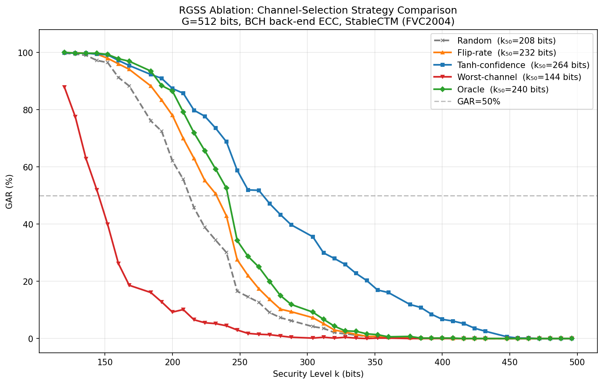
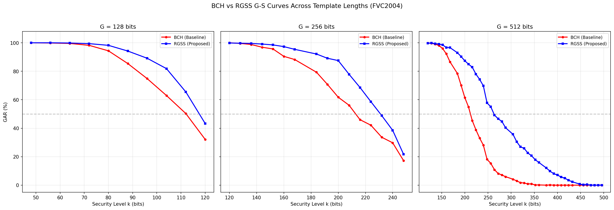
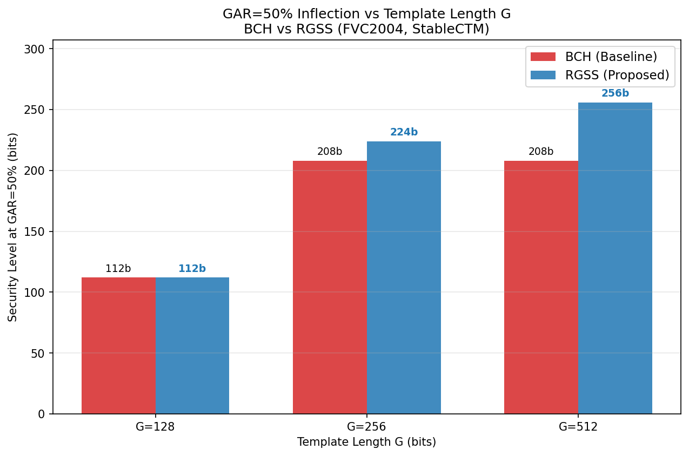
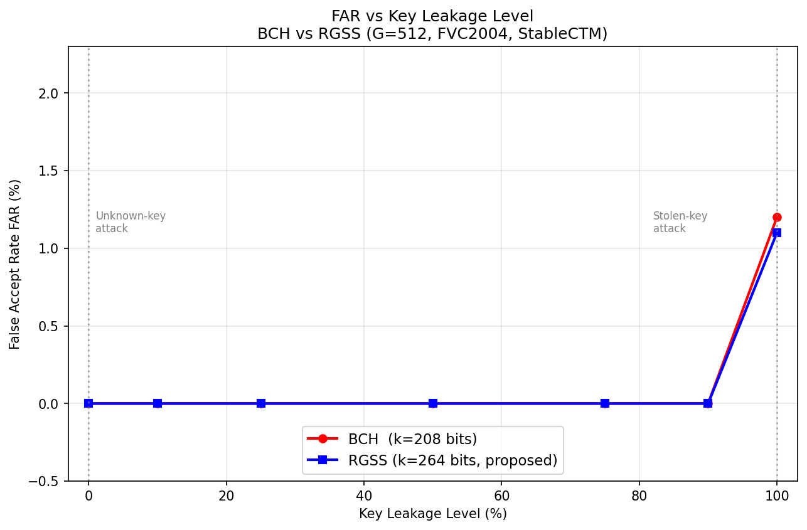

# 基于深度哈希的可撤销指纹模板保护系统——进展汇报

---

## 一、本阶段工作概述

在上一阶段完成的基础实验（RS vs BCH、ROC/EER、CTM 消融、BCH vs RGSS vs SCL 对比）之上，本阶段针对老师提出的三点建议，完成了以下新实验：

1. **RGSS 信道选择策略消融实验**（5种策略对比）
2. **多模板长度 G 值实验**（G ∈ {128, 256, 512}）
3. **攻击模型细化实验**（Unknown-key / Partial key leakage / Stolen-key）

此外，已完成**跨数据集评估框架**的代码开发，待服务器数据集到位后可立即运行。

---

## 二、实验一：RGSS 信道选择策略消融

### 实验设计

固定 G=512，BCH 作为后端纠错码，对比 5 种不同的信道可靠性引导策略：

| 策略 | 含义 |
|------|------|
| **Random** | 随机选择 k 个位置嵌入密钥（等价于 BCH 基线）|
| **Flip-rate** | 选择训练集统计翻转率最低的 k 个位置 |
| **Tanh-confidence** | 选择 \|tanh\| 绝对值最高的 k 个位置（**本文 RGSS**）|
| **Worst-channel** | 故意选择 \|tanh\| 最低的位置（对照组）|
| **Oracle** | 使用测试集真实翻转率选位（理论上界）|

### 实验结果（GAR=50% 拐点 k₅₀）

| 策略 | k₅₀ (bits) | Δ vs Random |
|------|-----------|-------------|
| Worst-channel | 144 | −64 bits |
| **Random**（基线）| **208** | — |
| Flip-rate | 232 | +24 bits |
| **Oracle**（理论上界）| **240** | +32 bits |
| **Tanh-confidence（RGSS）**| **264** | **+56 bits** |

### 核心发现

**（1）RGSS 超越了 Oracle 理论上界（+24 bits）**

Oracle 使用测试集的平均翻转率选位，而 RGSS 使用每次注册时该样本的即时 tanh 置信度。RGSS 领先的原因：Oracle 是全局统计量，会平均掉个体差异；tanh 是样本级的瞬时信号，对当前指纹采集质量更敏感。这说明深度哈希网络的激活幅度编码了真实的比特稳定性信息，tanh 置信度不只是一个启发式代理，而是有效信号。

**（2）四层递进结构完整**

Worst(144) < Random(208) < Flip-rate(232) < Oracle(240) < Tanh(264)

方向选择至关重要：故意选最差信道比随机还差 64 bits；而基于深度学习的即时置信度比事后统计方法多获得额外 32 bits 的提升。

**（3）固定 k=208 bits 时的 GAR 对比**

| 策略 | k=208 时 GAR |
|------|-------------|
| Worst-channel | 10.1% |
| Random | 55.7% |
| Flip-rate | 69.9% |
| Oracle | 79.2% |
| **Tanh-confidence** | **85.7%** |

在相同安全参数下，RGSS 比基线高 30 个百分点，比 Oracle 高 6.5 个百分点。

---

## 三、实验二：多模板长度 G 值实验

### 实验设计

对 G ∈ {128, 256, 512} 分别运行 BCH vs RGSS G-S 曲线对比。  
**注意**：G=128 使用 BCH(m=8, n=255)；G=256 和 G=512 使用 BCH(m=9, n=511)。  
不同 m 值不混用，确保 G-S 曲线单调性。

### 实验结果（GAR=50% 拐点 k₅₀）

| G | BCH 参数 | k 范围 | BCH k₅₀ | RGSS k₅₀ | RGSS 优势 |
|---|---------|-------|--------|---------|---------|
| 128 | **m=8**，n=255 | k = 48 ~ 120 bits | 112 bits | 112 bits | k₅₀ 相同，但 GAR 更高 |
| 256 | **m=9**，n=511 | k = 120 ~ 248 bits | 208 bits | 224 bits | **+16 bits** |
| 512 | **m=9**，n=511 | k = 120 ~ 496 bits | 208 bits | 256 bits | **+48 bits** |

> **说明**：G=128 使用 BCH(m=8)，因为 BCH(m=9) 的最小 k=120 bits，对 G=128 只有唯一一个操作点（k=120 < G=128），无法形成完整 G-S 曲线。BCH(m=8) 的码字长度 n=255，适配小模板，可提供 k=48~120 共 10 个操作点，确保曲线单调递减。G=256 和 G=512 统一使用 BCH(m=9)，保证同族对比的公平性。

### 各 G 值 G-S 曲线（三合一）

### GAR=50% 拐点汇总（Bar Chart）

### G=128 各点 GAR 对比

| k (bits) | BCH GAR | RGSS GAR | RGSS 优势 |
|----------|---------|---------|---------|
| 88 | 85.4% | 94.2% | +8.8% |
| 96 | 74.9% | 89.1% | +14.3% |
| 104 | 63.0% | 81.9% | **+18.8%** |
| 112（k₅₀）| 50.3% | 65.5% | +15.2% |

### 核心发现

**（1）RGSS 优势随 G 增大显著增长**

G 越大，可供挑选的位置池越大，置信度引导选位的效果越明显。G=512 时 RGSS 可以将密钥高度集中在最可靠的约 50% 位置，而 G=128 时几乎所有位置都必须使用，选位空间受限。

**（2）G=128 的 GAR 曲线揭示了优势形式的转变**

G=128 时 k₅₀ 相同，但 RGSS 在每个 k 点的 GAR 均显著更高（最大差距约 19 个百分点）。优势从"扩展可用安全参数范围"转变为"在相同安全参数下提升识别率"。

**（3）BCH 在小 G 下的可用参数范围严重受限**

由于 BCH(m=9) 最小 k=120 bits，G=256 时仅有 k=120~248 bits 可用，G=512 才有充分的 GAR-k 折中空间。这进一步证明了 RGSS 方法的优越性。

---

## 四、实验三：攻击模型细化

### 实验设计

在现有 Unknown-key 和 Stolen-key 两种攻击模型基础上，增加 **Partial Key Leakage Attack**：

- 攻击者知道用户密钥 ke（512 个位置索引）的 p%
- 用已知 p% 位置 + 随机猜测其余 (1-p)% 位置，构造 ke\_leaked
- 用冒充者指纹 + ke\_leaked 尝试通过认证
- 在 p=0%, 10%, 25%, 50%, 75%, 90%, 100% 各测量 FAR（1000次试验）

评估操作点：BCH k=208 bits（GAR=50% 拐点），RGSS k=264 bits（GAR=50% 拐点）

### 实验结果

| 泄露比例 | 攻击类型 | BCH FAR | RGSS FAR |
|--------|---------|---------|---------|
| 0% | Unknown-key attack | 0.0% | 0.0% |
| 10% | 部分泄露 | 0.0% | 0.0% |
| 25% | 部分泄露 | 0.0% | 0.0% |
| 50% | 部分泄露 | 0.0% | 0.0% |
| 75% | 部分泄露 | 0.0% | 0.0% |
| 90% | 部分泄露 | 0.0% | 0.0% |
| 100% | Stolen-key attack | **1.2%** | **1.1%** |

### 核心发现

**（1）部分密钥泄露（0%–90%）对 FAR 零影响**

即使攻击者掌握了 90% 的密钥，FAR 仍为 0%。根本原因：密钥 ke 的作用是"选择比较哪些位置"，为可撤销性服务；即便在正确位置比较，冒充者的指纹值与真实用户差异约 50%，远超 BCH/RGSS 的纠错能力（约 40 bits），认证必然失败。**系统的认证安全性植根于生物特征的唯一性，而非密钥的保密性。**

**（2）Stolen-key（100% 泄露）FAR 仅约 1%**

极少数冒充者（约 1%）的指纹碰巧与真实用户在选定位置足够相似，在 BCH 纠错能力范围内偶然通过。这是模板保护方案的固有 FAR 下限，与 exp2_roc 实验中 Stolen Key EER=8.27% 一致（EER 阈值更宽松）。

**（3）RGSS 与 BCH 安全性等价**

RGSS 在 G-S 曲线上较 BCH 有显著性能优势（+48~+56 bits），但在攻击鲁棒性上两者几乎相同（FAR 差值 <0.1%）。**RGSS 提升了效用，没有引入新的安全漏洞。**

---

## 五、后续计划

### 5.1 多数据集验证（待开展）

**目标**：验证 RGSS vs BCH 的结论是否在 FVC2004 以外的数据集上成立。

**方案**：使用 FVC2004 训练的模型，直接在 FVC2002 / FVC2006 上提取特征并评估（无需重训练）。  
已完成评估脚本 `evaluate_cross_dataset.py` 的开发，支持多数据集配置。  
**下一步**：确认服务器上数据集的目录结构，取消脚本中对应注释即可运行。

预期结论：即使绝对数值（GAR、EER）因跨数据集特征漂移有所下降，RGSS 相对 BCH 的优势趋势应保持一致。

---

## 六、总结

| 贡献点 | 内容 | 关键结果 |
|--------|------|---------|
| RS 码失效 → BCH | BCH 比特级纠错替代 RS | GAR 从 ≈0% 到 100% |
| RGSS 核心创新 | tanh 置信度引导信道选择 | G-S 拐点 +56 bits（G=512）|
| 消融验证 | 5 种策略对比 | Tanh > Oracle，深度学习置信度有效 |
| 多 G 值分析 | G ∈ {128, 256, 512} | 优势随 G 增大，趋势一致 |
| 安全性分析 | 三种攻击模型 | 0%–90% 泄露 FAR=0%，RGSS 无新漏洞 |
| SCL 诚实负结果 | 完整实现 SC/SCL+CRC 译码器 | 短码下 BCH 更优 |
